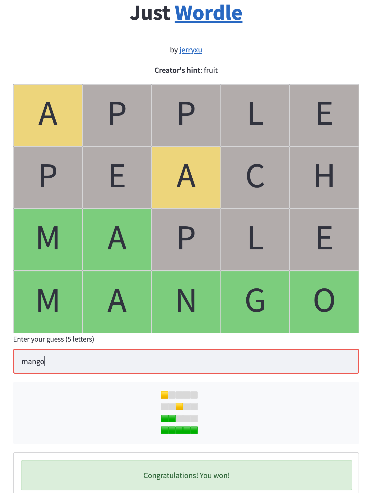

# Just Wordle
A wordle game website built completely with [Streamlit](https://streamlit.io/)

## What can you do with it?
- You can create a wordle of your choice - any words, any length
- You can share with your friends, with hints

## Why did I make it?
I am fan of Streamlit. While I teach js to high school students and have done an full-stack internship, deep down I still prefer Python and I am not good at front-end logic. 
Streamlit allows me to write anything in Python. This project was done in a short time just for me to learn how Streamlit works. 

The best way to learn a language/tool is to make a game with it. So here is https://justwordle.com/

